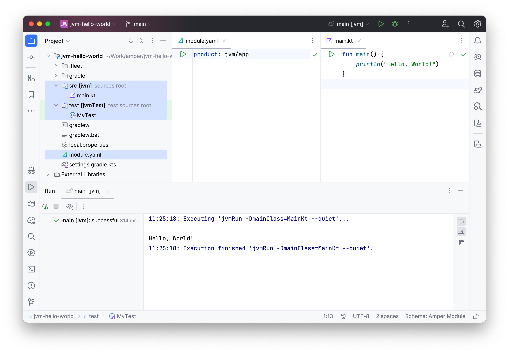
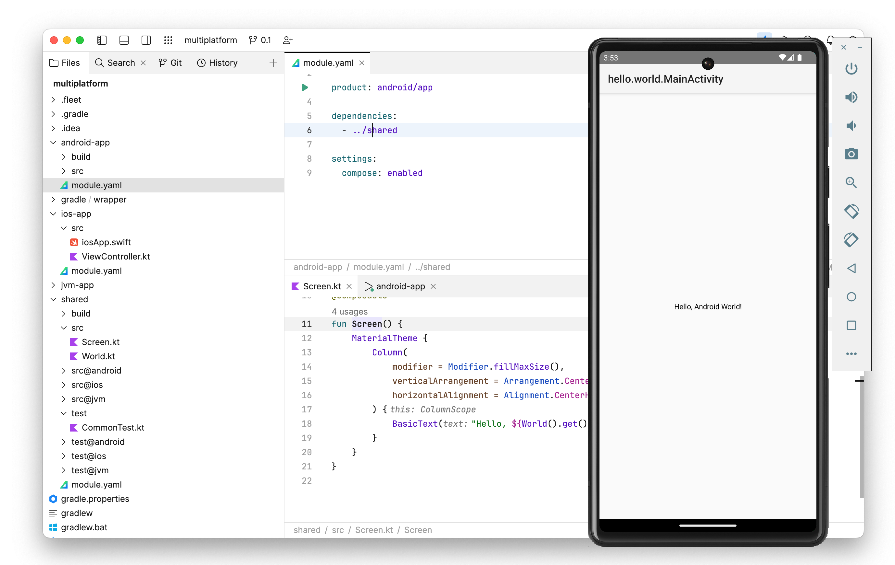

[](https://confluence.jetbrains.com/display/ALL/JetBrains+on+GitHub)
[](https://www.apache.org/licenses/LICENSE-2.0)
[](https://github.com/JetBrains/amper/tags)

# Amper

Amper is a build and project configuration tool. Its goal is to provide a great and smooth user experience and IDE support 
We believe that this can be achieved by:

- providing a developer- and IDE-friendly declarative configuration DSL - to simplify not only the initial setup but
  also improve maintainability and let an IDE assist with automatic configuration reliably;
- bundling a curated set of compatible toolchains and extensions - to support the majority of the scenarios without the need to find compatible plugins;
- carefully choosing the extensibility points - to keep the overall mental model and UX of the configuration consistent and to avoid unexpected third-party code execution.

In essence, we aim to achieve a similar well-thought-out and well-tested experience as with [JetBrains IDEs](https://www.jetbrains.com/ides/).

We’re currently looking at various aspects, including the configuration of projects for building, packaging, publishing,
and more. At the current stage, however, the focus is primarily on configuring projects for building. While the current
use case is Kotlin and Kotlin Multiplatform, Amper also supports Java and Swift (as a requirement for multiplatform).
However, the same approach to configuration could work for other languages and technology stacks in the future.

Amper is implemented as a Gradle-based tool and also as a standalone tool, and provides an easy-to-use declarative
configuration format.

Supported features:
* Creating and running JVM, Android, iOS, Linux and macOS applications.
* Creating Kotlin Multiplatform libraries.
* Running tests.
* Mixing Kotlin, Java and Swift code.
* Using [Compose Multiplatform](docs/Documentation.md#configuring-compose-multiplatform).
* [Multi-module](docs/Documentation.md#module-dependencies) projects.
* [Gradle interop](docs/Documentation.md#gradle-interop), including combining Amper and Gradle modules in one project.
* Integration with [Gradle version catalogs](docs/Documentation.md#dependencyversion-catalogs).
* [Gradle-compatible project layout](docs/Documentation.md#file-layout-with-gradle-interop) for the smooth migration of existing Gradle projects.
* Code assistance for [module files](docs/Documentation.md#module-file-anatomy) in IntelliJ IDEA and Fleet.

Planned features:
* More [product types](docs/Documentation.md#product-types) and platforms, such as watchOS, Windows, etc.
* [Platform-specific test types](docs/Documentation.md#special-types-of-tests), including android instrumented tests.
* [Native dependencies](docs/Documentation.md#native-dependencies) support, such as CocoaPods, Swift Package Manager.
* [Packaging](docs/Documentation.md#packaging) and [publication](docs/Documentation.md#publishing). 
* [Build variants](docs/Documentation.md#build-variants) support.
* [Extensibility](docs/Documentation.md#extensibility).
* Support more Kotlin and Kotlin Multiplatform scenarios and configurations out-of-the-box.

For a quick start:
* [Setup](docs/Setup.md) and [usage](docs/Usage.md) instructions
* [Tutorial](docs/Tutorial.md)  
* [Documentation](docs/Documentation.md) 
* [Example projects](examples)
* Gradle [migration guide](docs/GradleMigration.md)  

## Issues and feedback

Amper uses [YouTrack](https://youtrack.jetbrains.com/issues/AMPER) for issue tracking, [create a new issue](https://youtrack.jetbrains.com/newIssue?project=AMPER) there to report problems or submit ideas.

Before reporting an issue, please check the [FAQ](docs/FAQ.md) and the [list of known issues](docs/KnownIssues.md).

You can also join the [Slack channel](https://kotlinlang.slack.com/archives/C062WG3A7T8) for discussions, or share your feedback using the [feedback form](https://surveys.jetbrains.com/s3/Amper-feedback-form).     

## How to Try
There are multiple ways to try Amper:

* In the latest [IntelliJ IDEA](https://www.jetbrains.com/idea/nextversion/), for JVM and Android projects ([instructions](docs/Usage.md#using-amper-in-intellij-idea)).
* In the latest [JetBrains Fleet](https://www.jetbrains.com/fleet/), for the JVM, Android, and Kotlin Multiplatform projects ([instructions](docs/Usage.md#using-amper-in-fleet)).
* Using [command line Amper](docs/Usage.md#using-the-standalone-amper-from-command-line) to build standalone Amper projects.
* Use [Gradle](docs/Usage.md#using-the-gradle-based-amper-from-command-line) to build Gradle-based Amper projects.

## Examples

### Basics
Here is a very basics JVM "Hello, World!" project:


The `main.kt` and `MyTest.kt` files are just regular Kotlin files with nothing special in them. The interesting part is `module.yaml`, which is the Amper module configuration file. For the above project structure, it would simply be: 

```yaml
# Produce a JVM application 
product: jvm/app
```

That's it. The Kotlin and Java toolchains, test framework, and other necessary functionality is configured and available straight out of the box. You can build it, run it, write and run tests, and more. For more detailed information, check out the [full example](examples/jvm-with-tests).



### Multiplatform

Now, let's look at a Compose Multiplatform project with Android, iOS, and desktop JVM apps, with the following project structure in Fleet:


Notice how the `src/` folder contains Kotlin and Swift code together. It could, of course, also be Kotlin and Java.
Another aspect to highlight is the shared module with the common code in the `src` folder and the platform-specific code folders `src@ios` and `src@android` (learn more about [project layout](docs/Documentation.md#project-layout)).

Here is how `ios-app/module.yaml` file looks:
```yaml
# Produce an iOS application
product: ios/app

# Depend on the shared library module: 
dependencies:
  - ../shared

settings:
  # Enable the Compose Multiplatform framework
  compose: enabled
```

This is pretty straightforward: It defines an iOS application with a dependency on a shared module and enables the Compose Multiplatform framework. A more interesting example would be `shared/module.yaml`:

```yaml
# Produce a shared library for the JVM, Android, and iOS platforms:
product:
  type: lib
  platforms: [jvm, android, iosArm64, iosSimulatorArm64, iosX64]

# Shared Compose dependencies:
dependencies:
  - $compose.foundation: exported
  - $compose.material3: exported

# Android-only dependencies  
dependencies@android:
  # Android-specific integration with Compose
  - androidx.activity:activity-compose:1.7.2: exported
  - androidx.appcompat:appcompat:1.6.1: exported

# iOS-only dependencies with a dependency on a CocoaPod (not yet implemented)
dependencies@ios:
  - pod: 'Alamofire'
    version: '~> 2.0.1'

settings:
  # Enable Kotlin serialization
  kotlin:
    serialization: json
  
  # Enable Compose Multiplatform framework
  compose: enabled
```

A couple of things are worth mentioning. First, note the platform-specific dependencies: sections with the `@<platform>` qualifier. [The platform qualifier](docs/Documentation.md#platform-qualifier) can be used both in the manifest and also in the file layout. The qualifier organizes the code, dependencies, and settings for a certain platform.
Second, the dependencies: section allows not only Kotlin and Maven dependencies, but also [platform-specific package managers](docs/Documentation.md#native-dependencies), such as CocoaPods, Swift Package Manager, and others.



Naturally, these examples show only a limited set of Amper features. Look at the [documentation](docs/Documentation.md), [tutorial](docs/Tutorial.md), and [example projects](examples) to get more insight into Amper’s design and functionality.     

### More examples
Check our more real world examples:
* [JVM "Hello, World!"](examples/jvm-kotlin+java)
* Compose for [iOS](examples/compose-ios), [Android](examples/compose-android) and [desktop](examples/compose-desktop).
* [Multiplatform](examples/multiplatform) project with shared code.
* [Gradle interop](examples/gradle-interop)
* And [others](examples)
